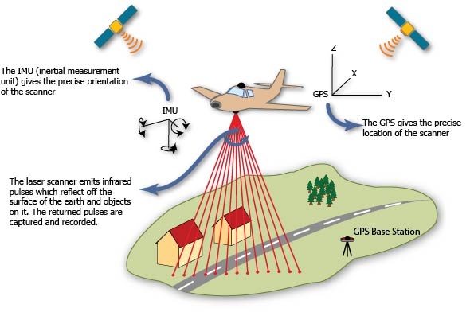

# Raydar

Library to detect light barriers from sunlight (e.g. for shadows) given a LIDAR (aerial laser scanning) point cloud, a WGS84 location and time (UTC).

## Explanation

### Airborne laser scanning

Image: http://gmv.cast.uark.edu/scanning-2/airborne-laser-scanning/

The algorithm uses data from an airborne laser scanner. The data points describe the height (first pulse) of a certain x,y coordinate in space.

### Algorithm

Right image shows top view onto the point cloud (black..purple points). Yellow arrow shows the direction of the sunray towards the point of interest (red cross or the observer). The orange arrow shows the left-right view of the observer. 

The left picture shows the point cloud projected at the face of the observer in the direction of the sun. In the origin of the axis the observer will see the sun. In the example his sight is not occluded, since there are no blue points.

In case there would be points in or above the origin (in the positive $z*$ direction), the observer would stand in shadow. Under a blue point we expect some solid, non-transparant structure like buildings or vegetation. In order to cope with inaccuracies of the laser scanner or the sun position calculation a small window (yellow vertical lines) is defined. If there are any points expected, we assume the observer is occluded.

## Data

Current prototype uses LIDAR data from Germany, NRW.

Monheim am Rhein:

Some information (German): [link](https://www.bezreg-koeln.nrw.de/brk_internet/geobasis/hoehenmodelle/oberflaechenmodell/index.html)

## Setup dev environment

### Windows

In order to install all the dependencies, follow https://geoffboeing.com/2014/09/using-geopandas-windows/
and https://www.lfd.uci.edu/~gohlke/pythonlibs/.