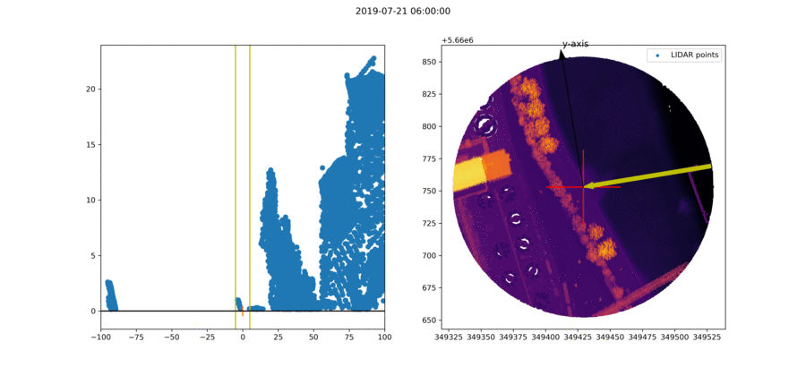
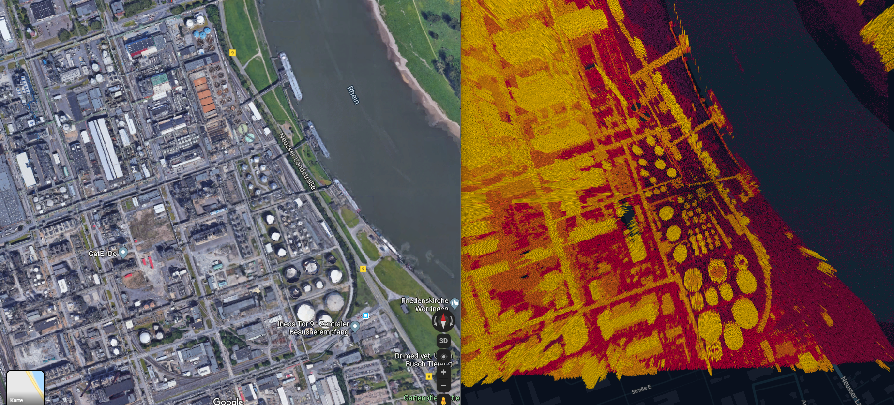

# Raydar

Library to detect light barriers from sunlight (e.g. for shadows) given a LIDAR (aerial laser scanning) point cloud, a WGS84 location and time (UTC).

## Explanation

Right image shows top view onto the point cloud (black..purple points). Yellow arrow shows the direction of the sunray towards the point of interest (red cross or the observer). The orange arrow shows the left-right view of the observer. As displayed on the left picture, the observer looks towards the sun.

If the observer detects any points between the two vertical yellow lines in the left plot, he probably (not valid for bridges) is standing behind an obstacle in shadow.

## Data

Current prototype uses LIDAR data from Germany, NRW.

Monheim am Rhein:

Some information (German): [link](https://www.bezreg-koeln.nrw.de/brk_internet/geobasis/hoehenmodelle/oberflaechenmodell/index.html)

## Setup dev environment

### Windows

In order to install all the dependencies, follow https://geoffboeing.com/2014/09/using-geopandas-windows/
and https://www.lfd.uci.edu/~gohlke/pythonlibs/.