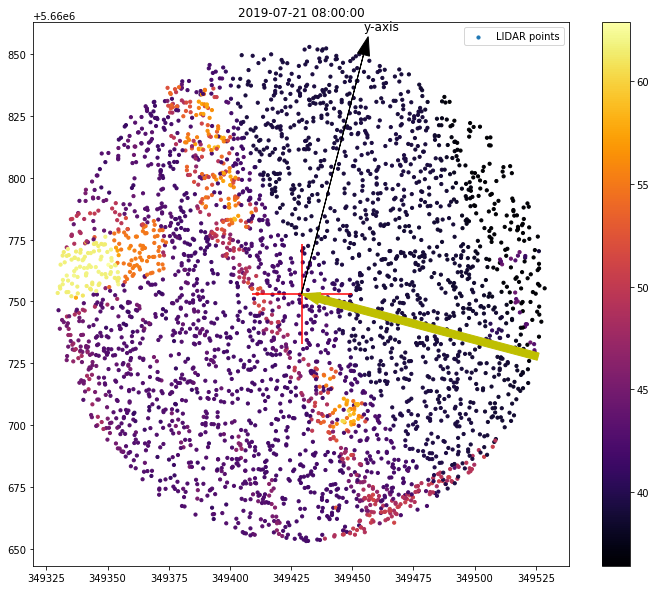

# Raydar

Library to detect light barriers from sunlight (e.g. for shadows) given a LIDAR (aerial laser scanning) point cloud, a WGS84 location and time (UTC).

Current prototype uses LIDAR data from Germany, NRW.

Monheim am Rhein:

Some information (German): [link](https://www.bezreg-koeln.nrw.de/brk_internet/geobasis/hoehenmodelle/oberflaechenmodell/index.html)

## Setup dev environment

### Windows

In order to install all the dependencies, follow https://geoffboeing.com/2014/09/using-geopandas-windows/
and https://www.lfd.uci.edu/~gohlke/pythonlibs/.